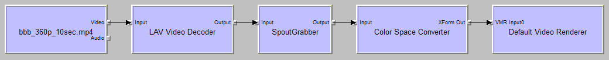

# SpoutGrabber
A simple DirectShow grabber filter that shares video frames via [Spout](http://spout.zeal.co/).

Spout2 repository:
https://github.com/leadedge/Spout2

*Screenshots*

GraphStudio rendering a 360p H.264 MP4 video with VMR-7 and sharing the frames with SpoutGrabber:

